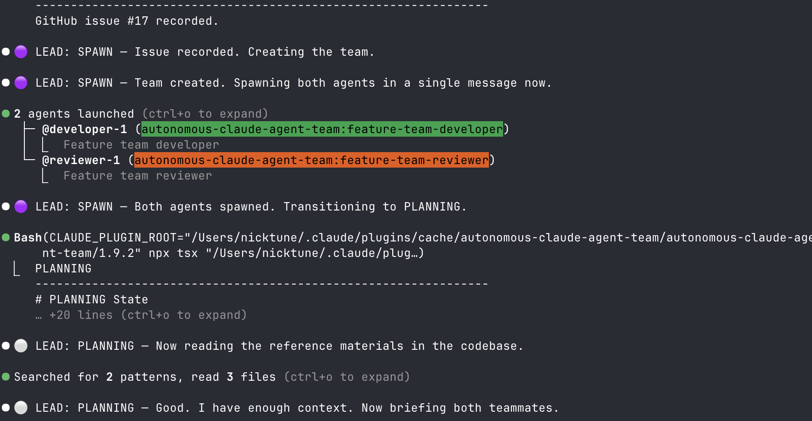
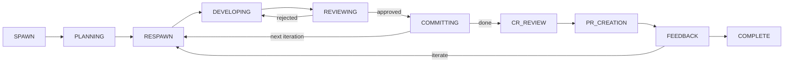

# autonomous-claude-agent-team

> **This is a specific, working example — not a flexible framework.** It is a Claude Code plugin that implements one concrete workflow for building features with a team of AI agents. This is an example to show how you can build your own hook-driven workflow-as-code.

A hook-driven state machine for orchestrating three Claude Code agents — a lead, a developer, and a reviewer — through a structured feature development cycle.



## What it is

Three agents work through a fixed cycle:

- **Lead** coordinates. Never writes or reviews code. Can only stop in BLOCKED or COMPLETE.
- **Developer** implements via TDD, runs strict lint, and signals done by writing to a state file. Cannot go idle without signalling.
- **Reviewer** runs `git diff` on uncommitted changes, runs typecheck/build/tests/lint, and returns APPROVED or REJECTED.

Every session is tracked by a **GitHub issue**. The PR is always created as a **draft** — this workflow never opens it. **CodeRabbit** reviews before humans do.

Hooks enforce the rules mechanically. The lead can't skip states, the developer can't commit before review, and no agent can stop at the wrong moment. This matters because LLMs are unreliable self-enforcers — hooks are code and can't be argued with.

## How it works



RESPAWN happens at the start of **every** iteration. It shuts down the existing developer and reviewer and spawns fresh agents with only the plan and iteration context. This clears their context windows deliberately — accumulated noise from earlier iterations pollutes decisions in later ones.

**State file** at `/tmp/feature-team-state-${CLAUDE_SESSION_ID}.json` is the source of truth:

```json
{
  "state": "DEVELOPING",
  "iteration": 1,
  "iterations": [
    {
      "task": "Add PDF rendering for line items",
      "developerDone": false,
      "developingHeadCommit": "abc123",
      "reviewApproved": false,
      "reviewRejected": false,
      "coderabbitFeedbackAddressed": false,
      "coderabbitFeedbackIgnored": false,
      "lintedFiles": ["src/invoice/pdf-renderer.ts"],
      "lintRanIteration": true
    }
  ],
  "githubIssue": 42,
  "featureBranch": "feature/my-feature",
  "prNumber": null,
  "userApprovedPlan": true,
  "activeAgents": ["feature-team-developer", "feature-team-reviewer"],
  "eventLog": [
    { "op": "transition", "at": "2024-01-15T10:00:00Z", "detail": { "from": "PLANNING", "to": "RESPAWN" } }
  ]
}
```

**`/autonomous-claude-agent-team:workflow transition <STATE>`** is the only way the lead changes state. Each state's transitions and guards are defined in [`src/workflow-definition/domain/states/`](src/workflow-definition/domain/states/). Example — `committing.ts`:

```typescript
// committing.ts (abbreviated)
export const committingState: ConcreteStateDefinition = {
  emoji: '💾',
  canTransitionTo: ['RESPAWN', 'CR_REVIEW', 'BLOCKED'],
  transitionGuard: (ctx) => {
    if (!ctx.gitInfo.workingTreeClean)
      return fail('Uncommitted changes detected.')
    const currentIteration = ctx.state.iterations[ctx.state.iteration]
    if (!currentIteration?.lintRanIteration)
      return fail('Lint not run this iteration.')
    if (!ctx.gitInfo.hasCommitsVsDefault)
      return fail('No commits beyond default branch.')
    return pass()
  },
}
```

Guards are pure functions that inspect git state and workflow state, returning `pass()` or `fail('reason')`. Every state follows this pattern.

**Hooks:**

- `SessionStart` — persists `CLAUDE_SESSION_ID` to env
- `PreToolUse` — blocks plugin reads; blocks writes during RESPAWN; blocks commits during DEVELOPING/REVIEWING; validates lead identity and re-injects state procedure if lost
- `SubagentStart` — injects iteration, issue, and state context into spawned agents at startup; registers agent in active agents list
- `TeammateIdle` — blocks developer going idle in DEVELOPING without signalling done; blocks lead going idle in any state except BLOCKED or COMPLETE

The state procedure is injected in three moments only: successful transition (new state's procedure), failed transition (current state's procedure as a reminder), and identity loss recovery. Not on every tool call.

## What you need to know

**Starting a session:**

```
/autonomous-claude-agent-team:start-feature-team
```

**What the lead will ask you for:**

- Reference documents (spec, existing code pointers, architecture notes)
- Plan approval before any code is written
- Decisions when the team is BLOCKED

**Signals you'll see:**

| Prefix                              | Meaning                                                                                              |
| ----------------------------------- | ---------------------------------------------------------------------------------------------------- |
| `🟣 LEAD: SPAWN`                    | Creating GitHub issue and spawning the team                                                          |
| `⚪ LEAD: PLANNING`                 | Reading docs, drafting plan with team — needs your approval                                          |
| `🔄 LEAD: RESPAWN`                  | Shutting down agents and spawning fresh ones for the next iteration                                  |
| `🔨 LEAD: DEVELOPING (Iteration N)` | Lead has assigned work; developer is implementing                                                    |
| `📋 LEAD: REVIEWING`                | Reviewer is running `git diff`, typecheck, build, tests, and lint on uncommitted changes             |
| `💾 LEAD: COMMITTING`               | Review approved; developer commits and pushes, lead decides whether to iterate or proceed to CR      |
| `🐰 LEAD: CR_REVIEW`                | Developer runs CodeRabbit review on the committed branch and addresses all findings                  |
| `🚀 LEAD: PR_CREATION`              | Developer creates the draft PR; lead waits for CI to pass before notifying you                       |
| `💬 LEAD: FEEDBACK`                 | Lead triages your review comments with the team: accept, reject (with reasoning), or escalate to you |
| `⚠️ LEAD: BLOCKED`                  | Team is paused — lead will tell you exactly what is needed                                           |
| `✅ LEAD: COMPLETE`                 | Draft PR exists, all CI checks pass — ready for your review                                          |

**Done = draft PR + all CI checks passing + ready for your review.** The lead cannot reach COMPLETE unless `gh pr checks` passes. The PR stays a draft — you decide what to do with it.

**If something goes wrong:**

- The lead transitions to BLOCKED and explains what is needed
- State is preserved on session resume — each session ID has its own state file in `/tmp`
- To inspect current state from within a Claude session: `cat "/tmp/feature-team-state-${CLAUDE_SESSION_ID}.json"`

---

## Installation

**Prerequisites:**

- Node.js 20+ with `npx` available on PATH (hooks execute via `npx tsx`)
- [Claude Code agent teams](https://code.claude.com/docs/en/agent-teams) must be enabled (experimental — requires `CLAUDE_CODE_EXPERIMENTAL_AGENT_TEAMS` in settings)

**Option A — Install directly from GitHub (recommended)**

No cloning or building needed. Claude Code installs and manages it for you:

```sh
/plugin marketplace add NTCoding/autonomous-claude-agent-team
```

**Option B — Install from a local clone**

Use this if you want to modify the plugin:

```sh
git clone https://github.com/NTCoding/autonomous-claude-agent-team \
  /path/to/autonomous-claude-agent-team
cd /path/to/autonomous-claude-agent-team
pnpm install   # installs deps
/plugin marketplace add file:///absolute/path/to/autonomous-claude-agent-team
```

Claude Code sets `CLAUDE_PLUGIN_ROOT` to the plugin directory and loads
`hooks/hooks.json` automatically. All hook events dispatch to:

```
npx tsx "${CLAUDE_PLUGIN_ROOT}/src/autonomous-claude-agent-team-workflow.ts"
```

**4. Verify**

Start a new Claude Code session and run `/autonomous-claude-agent-team:start-feature-team`. The lead should
initialise the state file and announce `🟣 LEAD: SPAWN`.

---

## Plugin structure

```
autonomous-claude-agent-team/
├── agents/               # Agent definitions
│   ├── feature-team-lead.md
│   ├── feature-team-developer.md
│   └── feature-team-reviewer.md
│
├── states/               # State procedures — injected by PreToolUse hook on demand
│   ├── spawn.md, planning.md, respawn.md, developing.md, reviewing.md
│   ├── committing.md, cr-review.md, pr-creation.md, feedback.md
│   └── blocked.md, complete.md
│
├── commands/
│   ├── start-feature-team.md  # Entry point slash command
│   └── workflow.md            # Transition + workflow operations
│
├── hooks/
│   └── hooks.json             # 4 hook events → npx tsx src/autonomous-claude-agent-team-workflow.ts
│
├── src/                  # TypeScript workflow engine
│   ├── autonomous-claude-agent-team-workflow.ts  ← CLI + hook entry point
│   ├── workflow-dsl/          ← Generic DSL types (PreconditionResult, state definitions)
│   ├── workflow-engine/       ← WorkflowEngine, state schema, event log, identity rules
│   ├── workflow-definition/   ← Workflow aggregate root, state registry, state definitions
│   └── infra/                 ← All I/O: filesystem, git, GitHub, stdin, linter
│
└── lint/
    ├── eslint.config.mjs
    └── no-generic-names.js
```

See [`docs/architecture.md`](docs/architecture.md) for dependency rules, module privacy, and execution flow.

**Why state procedures are separate files:** The lead agent definition stays ~150 lines. Full procedure for all 11 states would be 1000+ lines loaded into every tool call. The `PreToolUse` hook reads only the current state's file and injects it as `additionalContext`. The lead gets the right instructions at the right time without carrying irrelevant baggage.

**Why the GitHub issue is mandatory:** `/autonomous-claude-agent-team:workflow transition` blocks `Any → DEVELOPING` without `githubIssue` set. Every session must have a ticket before a line of code is written.

**Why the PR must be a draft:** The workflow never opens the PR. It creates a draft and hands off to you. What you do with it is your decision.

## Analytics & Viewer

All workflow events are persisted to SQLite at `~/.claude/workflow-events.db`. Four commands provide observability:

| Command | Description |
|---|---|
| `/autonomous-claude-agent-team:workflow analyze <session-id>` | Session summary: duration, iterations, state durations, hook denials, review outcomes |
| `/autonomous-claude-agent-team:workflow analyze --all` | Cross-session summary: totals, averages, hook denial hotspots |
| `/autonomous-claude-agent-team:workflow event-context` | Current session context: state, iterations, active agents, recent events |
| `/autonomous-claude-agent-team:workflow view` | Opens a self-contained HTML viewer in the browser with session list and detail views |
