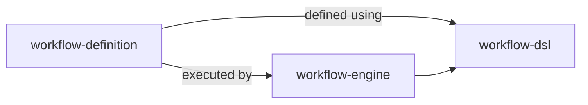
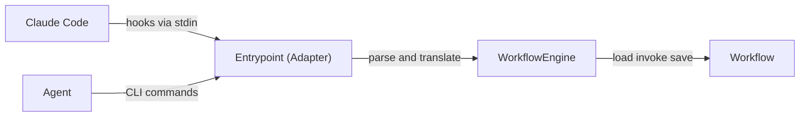

# Architecture

## Domain Modules

```
src/
├── workflow-dsl/          ← Language for defining workflows (states, transitions, guards, operations)
├── workflow-engine/       ← Runs workflows: rehydrate, execute, persist, format output
└── workflow-definition/   ← The actual workflow: states, rules, transitions, guards
```

`infra/` is the I/O boundary (filesystem, git, GitHub, stdin, linter) — not a domain module.

### Module Relationships



`workflow-dsl` is the language for defining states, transitions, guards, and operations. `workflow-definition` uses the DSL to declare the actual workflow (states, rules, guards). The engine loads and runs it. Dependency direction enforced by dependency-cruiser rules in `.dependency-cruiser.cjs`.

### Execution Flow



The entrypoint is a thin adapter — it parses inputs (hooks, CLI args), translates them to engine calls, and maps results to exit codes. The engine owns the load → execute → save cycle. Zero orchestration logic in the adapter.

### Module Privacy

External code accesses `workflow-engine` and `workflow-definition` only through barrel exports (`index.ts`). Internal `domain/` directories are private. Enforced by depcruiser rules `workflow-engine-module-privacy` and `workflow-definition-module-privacy`.

## WorkflowEngine

`WorkflowEngine<TWorkflow>` (in `workflow-engine/`) is the generic orchestration layer. It owns the rehydrate → execute → persist cycle:

- **`startSession()`**: Creates initial state if absent
- **`transaction()`**: Rehydrate → execute operation → persist → format output
- **`transition()`**: Rehydrate → validate transition → persist → format with procedure
- **`query()`**: Execute a read-only check against a rehydrated workflow (no persist)
- **`registerAgent()`**: Register a subagent and return context
- **`checkIdleAllowed()`**: Check if an agent can go idle
- **`shutDown()`**: Deregister an agent
- **`runLint()`**: Execute lint through the workflow
- **`verifyIdentity()`**: Check lead identity from transcript
- **`persistSessionId()`**: Write session ID to env file

The engine is parameterized by `RehydratableWorkflow` and `WorkflowFactory` interfaces, implemented by `WorkflowAdapter` in `workflow-definition/`.

## Aggregate Root: Workflow

`Workflow` (in `workflow-definition/domain/workflow.ts`) is the single aggregate root. All state mutations go through it:

- **State transitions**: `transitionTo(target)` — validates legality, runs guards, applies onEntry hooks
- **Workflow operations**: `recordIssue()`, `signalDone()`, `runLint()`, etc. — gated by `allowedWorkflowOperations` per state
- **Hook checks**: `checkWriteAllowed()`, `checkBashAllowed()`, `checkPluginSourceRead()`, `checkIdleAllowed()` — enforce state-specific permissions
- **Agent lifecycle**: `registerAgent()`, `shutDown()` — manage activeAgents list

### Rehydration Pattern

```typescript
// Engine handles rehydration internally:
engine.transaction(sessionId, 'record-issue', (w) => w.recordIssue(42))
engine.transition(sessionId, 'DEVELOPING')
engine.query((w) => w.checkWriteAllowed(tool, path), workflow)
```

## Thin Adapter (Entrypoint)

The entrypoint (`autonomous-claude-agent-team-workflow.ts`) is a thin adapter:

- **Arg parsing**: Validates CLI arguments (missing args, invalid numbers)
- **Stdin parsing**: Parses hook JSON input (PreToolUse, SubagentStart, TeammateIdle)
- **Hook-to-domain translation**: Maps hook events to engine method calls
- **Exit code mapping**: Translates `EngineResult` types to exit codes (success→0, blocked→2, error→1)

Zero orchestration logic in the adapter.

## Generic Constraint

`workflow-dsl` and `workflow-engine` MUST contain zero references to concrete state names (`SPAWN`, `PLANNING`, etc.), operation names (`record-issue`, `signal-done`, etc.), or workflow-specific logic. All types are generic with type parameters supplied by `workflow-definition`:

- **DSL types** (`TransitionContext`, `WorkflowStateDefinition`, `WorkflowRegistry`) accept `TStateName`, `TOperation`, `TForbiddenBash` type parameters
- **Engine state schema** uses `createWorkflowStateSchema(stateNames)` — a factory that accepts concrete state names at call time
- **Engine formatting** delegates to `WorkflowFactory` methods (`getOperationBody`, `getTransitionTitle`, `getEmojiForState`) — no hardcoded messages
- **Concrete types** (`StateName`, `WorkflowOperation`, `ForbiddenBashCommand`, `INITIAL_STATE`, `STATE_EMOJI_MAP`) live in `workflow-definition/domain/workflow-types.ts`

This ensures a completely different workflow can be defined without modifying `workflow-dsl` or `workflow-engine`.

## State Registry

`WORKFLOW_REGISTRY` maps each `StateName` to a `WorkflowStateDefinition`:

- `canTransitionTo` — legal target states (including BLOCKED)
- `allowedWorkflowOperations` — which CLI commands are valid in this state
- `transitionGuard` — precondition checks before leaving a state
- `onEntry` — state initialization when entering
- `forbidden` / `allowForbidden` — hook-level permission overrides

### BLOCKED State

BLOCKED is a universal escape state. Every non-terminal state includes `'BLOCKED'` in its `canTransitionTo`. The BLOCKED state:

- `onEntry`: saves `preBlockedState` (the state we came from)
- `transitionGuard`: enforces returning to `preBlockedState` only
- Source state guards are skipped when transitioning TO BLOCKED (emergency escape)
- `preBlockedState` is cleared when leaving BLOCKED

## Global Forbidden Rules

`GLOBAL_FORBIDDEN` in the registry defines patterns blocked across states:

- `bashPatterns`: regex patterns for `git commit`, `git push`, `git checkout`
- `pluginSourcePattern`: prevents reading plugin source code

State-specific enforcement:
- DEVELOPING/REVIEWING: commit/push blocked (COMMIT_BLOCKED_STATES)
- RESPAWN: all writes blocked (`forbidden.write`)
- COMMITTING: commits allowed via `allowForbidden.bash`
