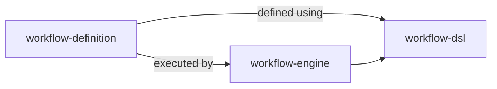
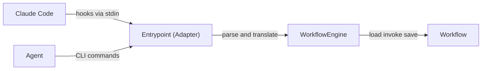
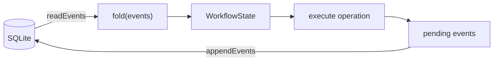

# Architecture

## Domain Modules

```
src/
├── workflow-dsl/          ← Language for defining workflows (states, transitions, guards, operations)
├── workflow-engine/       ← Runs workflows: rehydrate, execute, persist, format output
├── workflow-definition/   ← The actual workflow: states, rules, transitions, guards
├── workflow-event-store/  ← SQLite event persistence (createStore, appendEvents, readEvents)
└── workflow-analysis/     ← Session analytics, event viewer server, session view data
```

`infra/` is the I/O boundary (filesystem, git, GitHub, stdin, linter, composition root) — not a domain module.

### Module Relationships



`workflow-dsl` is the language for defining states, transitions, guards, and operations. `workflow-definition` uses the DSL to declare the actual workflow (states, rules, guards). The engine loads and runs it. Dependency direction enforced by dependency-cruiser rules in `.dependency-cruiser.cjs`.

### Execution Flow



The entrypoint is a thin adapter — it parses inputs (hooks, CLI args), translates them to engine calls, and maps results to exit codes. The engine owns the load → execute → save cycle. Zero orchestration logic in the adapter.

### Module Privacy

External code accesses `workflow-engine` and `workflow-definition` only through barrel exports (`index.ts`). Internal `domain/` directories are private. Enforced by depcruiser rules `workflow-engine-module-privacy` and `workflow-definition-module-privacy`.

## Storage: Event-Sourced SQLite

State is no longer persisted as a JSON snapshot. Events are the source of truth, stored in SQLite at `~/.claude/workflow-events.db`. State is derived at read time by folding the event log.

### SQLite Schema

```sql
CREATE TABLE IF NOT EXISTS events (
  seq        INTEGER PRIMARY KEY AUTOINCREMENT,
  session_id TEXT    NOT NULL,
  type       TEXT    NOT NULL,
  at         TEXT    NOT NULL,
  payload    TEXT    NOT NULL   -- JSON string
)
```

`seq` provides total ordering within a session. `PRAGMA journal_mode=WAL` allows concurrent reads without blocking writes.

### Storage Flow



### Transaction Flow

```typescript
engine.transaction(sessionId, 'record-issue', (w) => w.recordIssue(42))
// 1. readEvents(sessionId)  → BaseEvent[]
// 2. fold(events)           → WorkflowState
// 3. Workflow.rehydrate(state, deps) → Workflow aggregate
// 4. execute lambda         → appends domain events to pendingEvents[]
// 5. appendEvents(sessionId, workflow.getPendingEvents())
```

`fold()` is a pure function: `(events: readonly WorkflowEvent[]) → WorkflowState`. Each event type has a corresponding `applyEvent(state, event)` case. Observation events (idle-checked, write-checked, etc.) return state unchanged.

### workflow-event-store

`src/workflow-event-store/` provides the SQLite event persistence layer. `createStore(dbPath)` returns a `SqliteEventStore` object with methods:
- `appendEvents(sessionId, events[])` — transactional insert
- `readEvents(sessionId)` — ordered by `seq`, Zod-validated on read
- `sessionExists(sessionId)` / `listSessions()` — session queries

The returned store structurally satisfies the engine's `WorkflowEventStore` interface — no manual wiring needed.

### workflow-analysis

`src/workflow-analysis/` provides observability over event history:
- `workflow-analytics.ts` — pure query functions: `computeSessionSummary`, `computeCrossSessionSummary`, `computeEventContext`
- `workflow-viewer-server.ts` — HTTP server (`GET /api/sessions`, `GET /api/sessions/:id/events`, `GET /`)
- `session-view.ts` — data transformation for the viewer (event grouping, state durations, timeline proportions)

### workflow-definition domain files

- `src/workflow-definition/domain/fold.ts` — `fold(events)`, `applyEvent(state, event)`, `EMPTY_STATE`
- `src/workflow-definition/domain/workflow-events.ts` — `WorkflowEvent` discriminated union with Zod schemas

### workflow-engine domain files

- `src/workflow-engine/domain/base-event.ts` — `BaseEvent { type: string, at: string }`

## WorkflowEngine

`WorkflowEngine<TWorkflow>` (in `workflow-engine/`) is the generic orchestration layer. It owns the rehydrate → execute → persist cycle. Five methods:

- **`startSession()`**: Appends `session-started` event if no session exists
- **`transaction()`**: readEvents → fold → rehydrate → execute lambda → appendEvents
- **`transition()`**: Rehydrate → validate transition → persist → format with procedure
- **`persistSessionId()`**: Write session ID to env file
- **`hasSession()`**: Check whether events exist for a session (via `sessionExists`)

The engine is parameterized by `RehydratableWorkflow` and `WorkflowFactory` interfaces, implemented by `WorkflowAdapter` in `workflow-definition/`. `WorkflowEngine` has zero imports from `workflow-definition/` (enforced by dependency-cruiser rule `no-workflow-definition-in-engine`).

### RehydratableWorkflow Interface

```typescript
interface RehydratableWorkflow {
  getState(): WorkflowState
  getPendingEvents(): readonly BaseEvent[]
  transitionTo(target: string): PreconditionResult
  // ... workflow operation methods
}
```

## Aggregate Root: Workflow

`Workflow` (in `workflow-definition/domain/workflow.ts`) is the single aggregate root. All domain mutations go through it. State is maintained in-memory via `applyEvent` after each `append()` call.

### Mutation Pattern

```typescript
private append(event: WorkflowEvent): void {
  this.pendingEvents.push(event)
  this.state = applyEvent(this.state, event)  // keeps state current within a transaction
}
```

This ensures guards and checks within a single transaction read up-to-date state.

### Methods

- **State transitions**: `transitionTo(target)` — validates legality, runs guards, applies onEntry hooks
- **Workflow operations**: `recordIssue()`, `signalDone()`, `runLint()`, etc. — gated by `allowedWorkflowOperations` per state
- **Hook checks**: `checkWriteAllowed()`, `checkBashAllowed()`, `checkPluginSourceRead()`, `checkIdleAllowed()` — enforce state-specific permissions
- **Agent lifecycle**: `registerAgent()`, `shutDown()` — manage activeAgents list
- **Identity**: `verifyIdentity(transcriptPath)` — calls `checkLeadIdentity`, appends `identity-verified` event, fails on `'lost'`
- **Observability**: `writeJournal(agentName, content)` — appends `journal-entry` event; `requestContext(agentName)` — appends `context-requested` event

### Rehydration

```typescript
// Primary path (engine uses this):
WorkflowAdapter.rehydrate(events, deps)
// → fold(events) → WorkflowState → Workflow.rehydrate(state, deps)

// Test compatibility path (existing aggregate tests use this):
Workflow.rehydrate(state, deps)
```

## Observation Events

Observation events record what happened during hook checks and identity verification. They do not change `WorkflowState` (fold returns state unchanged for observation types). They exist solely for analytics and audit.

| Event type | Emitted by | Payload |
|---|---|---|
| `identity-verified` | `verifyIdentity()` | `status`, `transcriptPath` |
| `idle-checked` | `checkIdleAllowed()` | `agentName`, `allowed`, `reason?` |
| `write-checked` | `checkWriteAllowed()` | `tool`, `filePath`, `allowed`, `reason?` |
| `bash-checked` | `checkBashAllowed()` | `tool`, `command`, `allowed`, `reason?` |
| `plugin-read-checked` | `checkPluginSourceRead()` | `tool`, `path`, `allowed`, `reason?` |
| `journal-entry` | `writeJournal()` | `agentName`, `content` |
| `context-requested` | `requestContext()` | `agentName` |

Hook check DB failure → fail closed (deny operation, log to stderr). This is a security property.

## Thin Adapter (Entrypoint)

The entrypoint (`autonomous-claude-agent-team-workflow.ts`) is a thin adapter:

- **Arg parsing**: Validates CLI arguments (missing args, invalid numbers)
- **Stdin parsing**: Parses hook JSON input (PreToolUse, SubagentStart, TeammateIdle)
- **Hook-to-domain translation**: Maps hook events to engine method calls
- **Exit code mapping**: Translates `EngineResult` types to exit codes (success→0, blocked→2, error→1)

Zero orchestration logic in the adapter.

### CLI Commands

Workflow commands: `init`, `transition`, `record-issue`, `record-branch`, `record-plan-approval`, `assign-iteration-task`, `signal-done`, `record-pr`, `create-pr`, `append-issue-checklist`, `tick-iteration`, `review-approved`, `review-rejected`, `coderabbit-feedback-addressed`, `coderabbit-feedback-ignored`

Analytics/observability: `write-journal <agent-name> <content>`, `event-context [agent-name]`, `analyze [session-id | --all]`, `view`

## Generic Constraint

`workflow-dsl` and `workflow-engine` MUST contain zero references to concrete state names (`SPAWN`, `PLANNING`, etc.), operation names (`record-issue`, `signal-done`, etc.), or workflow-specific logic. All types are generic with type parameters supplied by `workflow-definition`:

- **DSL types** (`TransitionContext`, `WorkflowStateDefinition`, `WorkflowRegistry`) accept `TStateName`, `TOperation`, `TForbiddenBash` type parameters
- **Engine state schema** uses `createWorkflowStateSchema(stateNames)` — a factory that accepts concrete state names at call time
- **Engine formatting** delegates to `WorkflowFactory` methods (`getOperationBody`, `getTransitionTitle`, `getEmojiForState`) — no hardcoded messages
- **Concrete types** (`StateName`, `WorkflowOperation`, `ForbiddenBashCommand`, `INITIAL_STATE`, `STATE_EMOJI_MAP`) live in `workflow-definition/domain/workflow-types.ts`

This ensures a completely different workflow can be defined without modifying `workflow-dsl` or `workflow-engine`.

## State Registry

`WORKFLOW_REGISTRY` maps each `StateName` to a `WorkflowStateDefinition`:

- `canTransitionTo` — legal target states (including BLOCKED)
- `allowedWorkflowOperations` — which CLI commands are valid in this state
- `transitionGuard` — precondition checks before leaving a state
- `onEntry` — state initialization when entering
- `forbidden` / `allowForbidden` — hook-level permission overrides

### BLOCKED State

BLOCKED is a universal escape state. Every non-terminal state includes `'BLOCKED'` in its `canTransitionTo`. The BLOCKED state:

- `onEntry`: saves `preBlockedState` (the state we came from) via the `transitioned` event's `from` field
- `transitionGuard`: reads `ctx.state.preBlockedState` and enforces returning to it only
- Source state guards are skipped when transitioning TO BLOCKED (emergency escape)
- `preBlockedState` is cleared when leaving BLOCKED

## Global Forbidden Rules

`GLOBAL_FORBIDDEN` in the registry defines patterns blocked across states:

- `bashPatterns`: regex patterns for `git commit`, `git push`, `git checkout`
- `pluginSourcePattern`: prevents reading plugin source code

State-specific enforcement:
- DEVELOPING/REVIEWING: commit/push blocked (COMMIT_BLOCKED_STATES)
- RESPAWN: all writes blocked (`forbidden.write`)
- COMMITTING: commits allowed via `allowForbidden.bash`
