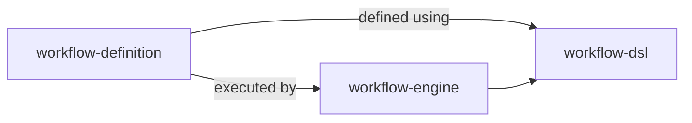
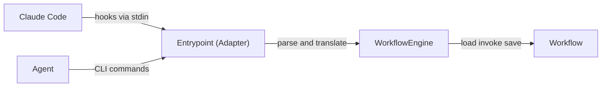
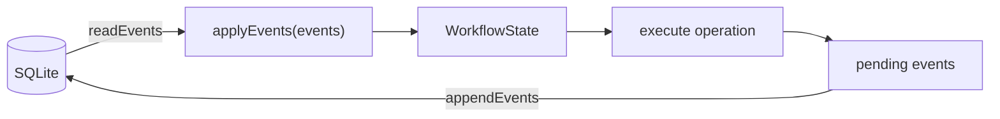

# Architecture

## Domain Modules

```
src/
├── workflow-dsl/          ← Language for defining workflows (states, transitions, guards, operations)
├── workflow-engine/       ← Runs workflows: rehydrate, execute, persist, format output
├── workflow-definition/   ← The actual workflow: states, rules, transitions, guards
├── workflow-event-store/  ← SQLite event persistence (createStore, appendEvents, readEvents)
└── workflow-analysis/     ← Session analytics, static HTML viewer, session view data
```

`infra/` is the I/O boundary (filesystem, git, GitHub, stdin, linter, composition root) — not a domain module.

### Module Relationships



`workflow-dsl` is the language for defining states, transitions, guards, and operations. `workflow-definition` uses the DSL to declare the actual workflow. The engine loads and runs it. Dependency direction enforced by dependency-cruiser.

### Execution Flow



The entrypoint is a thin adapter — it parses inputs (hooks, CLI args), translates them to engine calls, and maps results to exit codes. Zero orchestration logic in the adapter.

### Module Privacy

External code accesses `workflow-engine` and `workflow-definition` only through barrel exports (`index.ts`). Internal `domain/` directories are private. Enforced by depcruiser rules.

## Storage: Event-Sourced SQLite

Events are the source of truth, stored in SQLite at `~/.claude/workflow-events.db`. State is derived at read time by folding the event log.



`applyEvents()` is a pure function: `(events: readonly WorkflowEvent[]) → WorkflowState`. Observation events (idle-checked, write-checked, etc.) return state unchanged — they exist solely for analytics and audit.

## Generic Constraint

`workflow-dsl` and `workflow-engine` contain zero references to concrete state names, operation names, or workflow-specific logic. All types accept type parameters supplied by `workflow-definition`. This ensures a completely different workflow can be defined without modifying `workflow-dsl` or `workflow-engine`.

## State Registry

`WORKFLOW_REGISTRY` maps each `StateName` to a `WorkflowStateDefinition` with: legal transitions, allowed operations, transition guards, entry hooks, and permission overrides. BLOCKED is a universal escape state — every non-terminal state can transition to it, and it enforces returning to the originating state.

## Global Forbidden Rules

`GLOBAL_FORBIDDEN` defines patterns blocked across states: `git commit`, `git push`, `git checkout` via bash, and reading plugin source code. State-specific enforcement adds further restrictions (e.g., DEVELOPING blocks commits, RESPAWN blocks all writes, COMMITTING allows commits).
